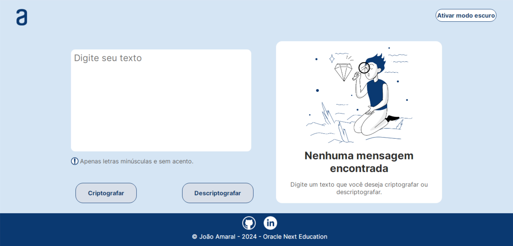
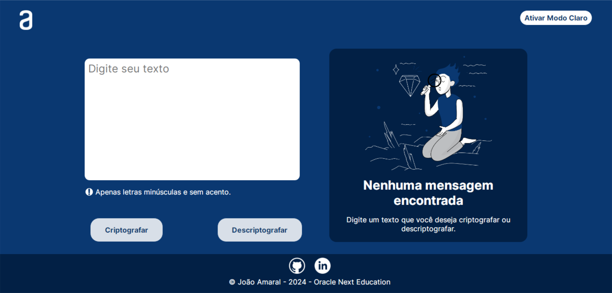

# Projeto Criptografador/Descriptografador - Desafio One Oracle Next Education

Este projeto é um criptografador/descriptografador de texto, desenvolvido como parte do primeiro desafio do programa Oracle Next Education.

## Tecnologias Utilizadas

- 
- 
- 

## Capturas de Tela

### Modo Claro

*Captura de tela do modo claro. Descrição opcional.*

### Modo Escuro

*Captura de tela do modo escuro. Descrição opcional.*

## Funcionalidades

- Criptografar texto.
- Descriptografar texto.
- Modo claro e escuro para uma melhor experiência visual.

## Como Executar

1. Clone o repositório: `git clone [https://github.com/seu-usuario/seu-repositorio.git](https://github.com/joaoamaral-dev/one-challenge01)`
2. Abra o arquivo `index.html` no seu navegador.

## Acesso Online

O projeto está disponível online através do [GitHub Pages](https://joaoamaral-dev.github.io/one-challenge01/).

## Contribuição

Contribuições são bem-vindas! Sinta-se à vontade para abrir issues e pull requests.

## Licença

Este projeto está licenciado sob a Licença MIT - veja o arquivo [LICENSE.md](LICENSE.md) para detalhes.

---

**Desenvolvido por João Victor Amaral para o Desafio One Oracle Next Education**
